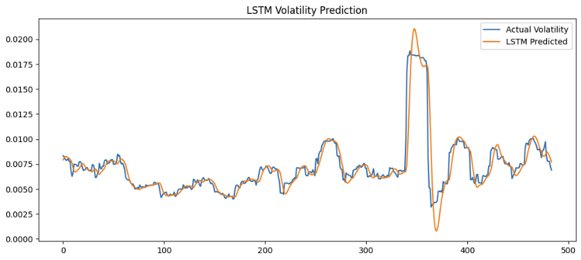
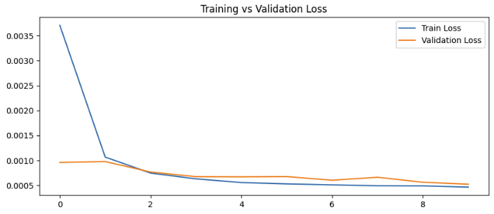
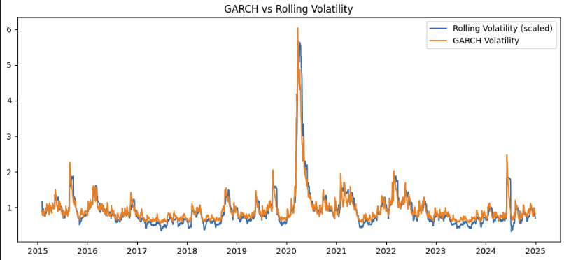
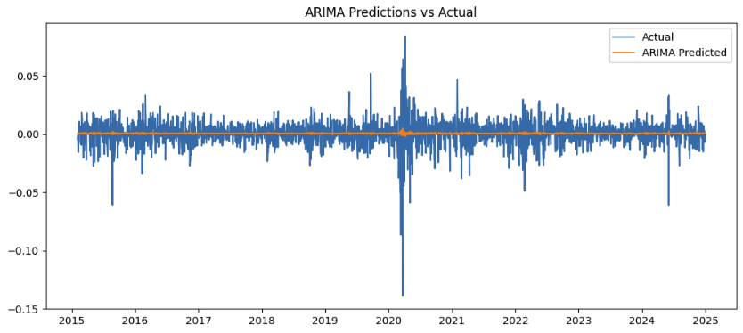

# Volatility Forecasting & Risk Analysis System

## Overview

This project builds an end-to-end quantitative finance pipeline to model market volatility, estimate financial risk, and evaluate trading strategies using real-world market data (NIFTY 50).

It integrates statistical models, deep learning, and risk metrics to simulate realistic financial behavior and decision-making.

---

## Dataset

- Source: NIFTY 50 Index
- Frequency: Daily data
- Time Period: 2015–2025

---

## Objectives

* Forecast volatility using ARIMA, GARCH, and LSTM models
* Quantify financial risk using Value at Risk (VaR) and Conditional VaR (CVaR)
* Backtest volatility-based trading strategies
* Analyze financial behavior such as volatility clustering and tail risk

---

## Key Results

- Hybrid strategy achieved better risk-adjusted performance than individual models
- Maximum drawdown reduced compared to market benchmark
- GARCH successfully captured volatility clustering
- LSTM achieved lower RMSE but showed higher instability
- VaR underestimates extreme tail risk, while CVaR provides a more realistic measure of potential losses during market stress

---

## Project Workflow

Data → Returns → Volatility → Models → Risk (VaR/CVaR) → Backtesting → Evaluation → Insights

---

## Visual Results

### Strategy Performance

### Drawdown Analysis

### VaR & CVaR Analysis

### Model Performance

---
## Models Used

### ARIMA (Baseline Model)

* Models time-series behavior of returns
* Used as a benchmark
* Limitation: Cannot capture volatility clustering

---

### GARCH (Core Model)

* Captures volatility clustering in financial markets
* Industry-standard for volatility modeling

Core Equation:

σ²ₜ = ω + αr²ₜ₋₁ + βσ²ₜ₋₁

Insight:
If α + β ≈ 1 → volatility is highly persistent

---

### LSTM (Deep Learning Model)

* Captures nonlinear temporal patterns
* Achieves lower RMSE compared to GARCH
* Less interpretable and may overfit

---

## Risk Modeling

### Value at Risk (VaR)

* Estimates maximum expected loss at a given confidence level
* Implemented using GARCH volatility

### Conditional Value at Risk (CVaR)

* Measures average loss beyond VaR
* Captures extreme tail risk

Key Insights:

* 95% VaR is well calibrated
* 99% VaR shows excess violations, indicating underestimation of extreme risk
* CVaR reveals significantly larger losses, confirming fat-tail behavior

---

## Backtesting Strategy

### Strategy Logic

* High volatility → Reduce exposure
* Low volatility → Increase exposure

### Implementations

* GARCH-based strategy
* LSTM-based strategy
* Hybrid strategy (combined signals)

### Results

* Reduced drawdowns compared to market
* Improved risk-adjusted performance
* Slightly lower returns than Buy & Hold

---

## Model Comparison

* LSTM achieves lower RMSE using squared returns as a volatility proxy
* GARCH provides more stable and interpretable estimates
* GARCH is preferred for financial risk modeling despite higher RMSE

---

## Key Insights

* Financial returns exhibit volatility clustering
* Markets show heavy-tailed behavior (non-normality)
* Risk increases significantly during crises (e.g., COVID)
* VaR underestimates extreme losses, while CVaR captures tail risk
* Volatility-based strategies improve downside protection

---

## Tech Stack

* Python
* Pandas, NumPy
* Matplotlib
* Statsmodels
* ARCH
* TensorFlow / Keras

---

## Project Structure

* `data/` → processed datasets
* `notebooks/` → model development and analysis
* `results/` → model outputs
* `src/` → reusable code

---

## How to Run

Install dependencies:

pip install -r requirements.txt

Run notebooks in sequence from the `notebooks/` folder.
 
 
