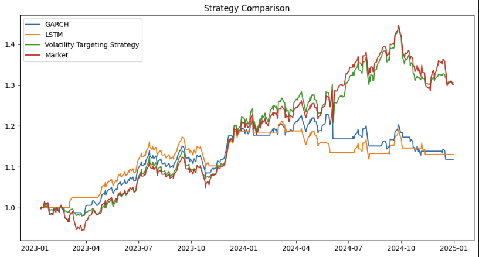
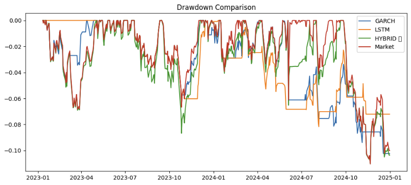
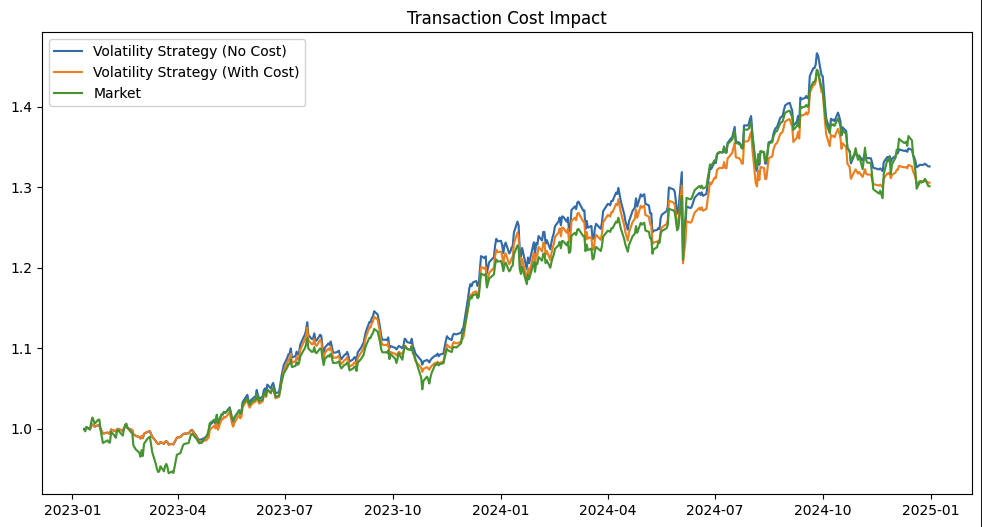
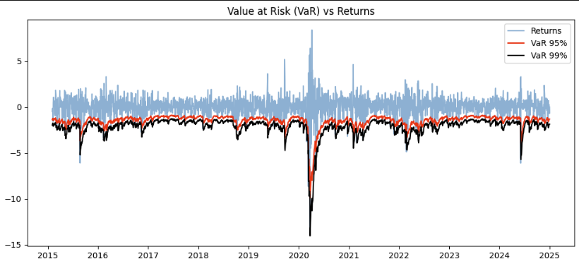
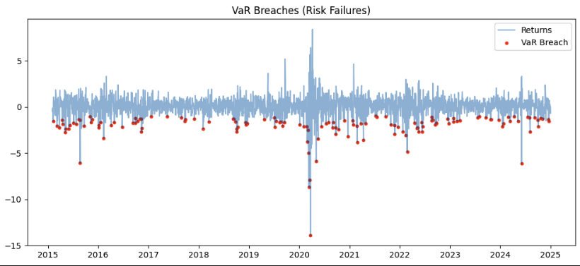
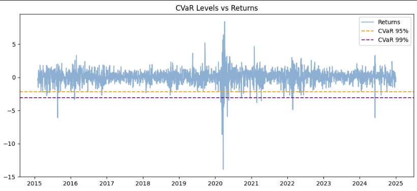

# Volatility Forecasting & Risk-Aware Trading System


---

## Overview

This project builds an end-to-end **quantitative finance pipeline** for modeling market volatility, estimating tail risk, and designing a **risk-managed trading strategy** using NIFTY 50 data.

The system integrates:

- Statistical models (**ARIMA, GARCH**)  
- Deep learning (**LSTM**)  
- Risk metrics (**VaR, CVaR**)  
- Strategy design (**Volatility Targeting**)  

Unlike traditional return-maximization approaches, this project focuses on **risk-adjusted performance, drawdown control, and volatility-aware capital allocation**, closely reflecting real-world quant trading frameworks.

---

## Dataset

- **Source:** NIFTY 50 Index  
- **Frequency:** Daily  
- **Period:** 2015 – 2025  

---

## Objectives

- Forecast volatility using ARIMA, GARCH, and LSTM  
- Estimate tail risk using VaR and CVaR  
- Build a **volatility-targeted trading strategy**  
- Evaluate performance using **Sharpe ratio and drawdown**  

---

## Final Results

| Metric                   | GARCH| LSTM | Market | Volatility Strategy |
|--------------------------|------|------|--------|---------------------|
| Return                   | 1.11 | 1.13 | 1.30   | **1.305**           |
| Sharpe Ratio             | 0.61 | 0.85 | 1.19   | **1.24**            |
| Max Drawdown             | —    | —    | -11.03%| **-10.05%**         |

### Key Takeaways

- Volatility strategy achieved **higher Sharpe ratio than market**
- Reduced drawdown → better **risk control**
- Maintained competitive returns (~market-level performance)

Strategy improves **risk-adjusted returns**, not just raw returns

---

## Project Workflow


Data → Returns → Volatility → Modeling → Risk Estimation → Strategy → Backtesting → Evaluation

---


---

## Visual Results

### Strategy Performance


### Drawdown Comparison


### Transaction Cost Impact


### Risk Analysis




---

## Models Used

### ARIMA (Baseline)
- Captures time-series structure  
- Used for benchmarking  
- Cannot model volatility clustering  

---

### GARCH (Core Model)
- Captures volatility clustering and persistence  
- Industry-standard in risk modeling  

**Equation:**
σ²ₜ = ω + αr²ₜ₋₁ + βσ²ₜ₋₁  


If α + β ≈ 1 → volatility is persistent  

---

### LSTM (Deep Learning)
- Captures nonlinear temporal patterns  
- Lower RMSE vs GARCH  
- Less stable during regime shifts  

---

## Risk Modeling

### Value at Risk (VaR)
- Estimates worst expected loss at a confidence level  
- Based on GARCH volatility  

---

### Conditional Value at Risk (CVaR)
- Measures expected loss beyond VaR  
- Better captures **extreme tail risk**  

---

## Trading Strategy

### Volatility Targeting Strategy

Core idea:

- Scale position using:

Position ∝ Target Volatility / Forecasted Volatility


### Strategy Logic

- High volatility → reduce exposure  
- Low volatility → increase exposure  
- Trend filter → avoid adverse regimes  
- Transaction costs included  

---

## Performance Insights

- Lower drawdown than market → improved **capital protection**
- Higher Sharpe ratio → better **risk-adjusted efficiency**
- Stable across volatility regimes  

Strategy behaves like a **risk-managed portfolio allocator**, not a speculative model

---

## Key Insights

- Financial markets exhibit **volatility clustering**
- Returns are **non-normal (fat tails)**
- VaR underestimates extreme losses
- CVaR better reflects real risk
- Risk-based strategies outperform naive allocation in stability

---

## Tech Stack

- Python  
- Pandas, NumPy  
- Matplotlib  
- Statsmodels  
- ARCH  
- TensorFlow / Keras  

---

## Project Structure

- `data/` → processed datasets  
- `notebooks/` → model development and experiments  
- `results/` → model outputs and metrics  
- `src/` → reusable modules  

---

## How to Run

```bash
pip install -r requirements.txt
---

Install dependencies:

pip install -r requirements.txt

Run notebooks in sequence from the `notebooks/` folder.
 
 
